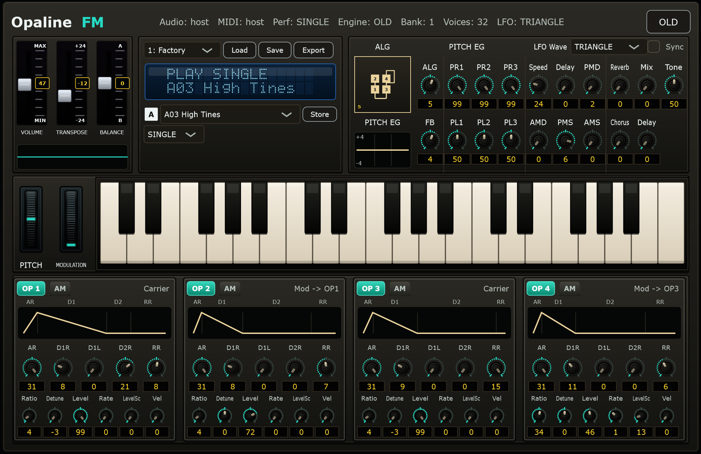

# Opaline FM

[English](README.md) | [技術仕様書](docs/OpalineFM_Spec_ja.md)

Opaline FMは、C++とJUCEで開発された無料の4オペレーターFMシンセサイザーです。1980年代のクラシックなデジタルFM楽器を参考にし、互換32音色SysExバンクの読み込みと保存に対応します。

Opaline FMは独立したプロジェクトであり、ヤマハ株式会社とは提携していません。



## 主な機能

- 8アルゴリズムとオペレーターフィードバックを備えた4オペレーターFM音源
- FMレンダリングエンジン
- 互換32音色SysExバンクの読み込みと保存
- SINGLE、DUAL、SPLITの演奏モード
- Pitch EG、振幅EG、LFO、キーボードスケーリング、ベロシティ、オペレーターAM
- ピッチベンド、モジュレーションホイール、サステインペダル、ポルタメント
- 音色編集、初期化、コピー/ペースト、単音色の読み書き、STORE
- リバーブ、ディレイ、コーラス、個別Mix、Tone
- スタンドアロン版のWAV録音
- 署名・公証済みmacOSスタンドアロン/VST3/Audio Unitインストーラーパッケージ

## ダウンロード

現在の公開リリースはmacOS版のみです。署名・公証済みパッケージは [GitHub Releases](https://github.com/Hidecade/OpalineFM/releases) からダウンロードできます。

使いたい形式に合わせて選んでください。

- `OpalineFM-Standalone-0.3.2.0-macOS.pkg`: 単体アプリとして使う場合。DAWなしでOpaline FMを演奏できます。
- `OpalineFM-AU-0.3.2.0-macOS.pkg`: Logic Pro、GarageBand、AU対応DAWで使う場合。
- `OpalineFM-VST3-0.3.2.0-macOS.pkg`: VST3対応DAWで使う場合。

Windows版インストーラーは現在の公開リリースには含めていません。Windows用のビルドスクリプトは開発・検証用としてリポジトリに残しています。

GitHub Releasesに表示される`Source code`アーカイブはGitHubが自動生成するものです。通常のインストールでは、上記の`.pkg`インストーラーを選んでください。

## クイックスタート

1. スタンドアロンアプリを起動するか、DAWのインストゥルメントとしてOpaline FMを挿入します。
2. スタンドアロンでは、ヘッダーからオーディオ出力とMIDI入力を選択します。
3. 音色バンクを選び、音色Aを選択します。
4. MIDIキーボード、画面鍵盤、またはプラグイン版StandaloneのPCキーボードで演奏します。
5. オペレーターや全体設定を編集します。変更をライブラリーへ残す場合は**STORE**を押します。

VST3ではDAWのショートカットを妨げないよう、PCの文字キーによる発音を無効にしています。MIDI入力と画面鍵盤は使用できます。

## 音色選択とライブラリー

バンクセレクターで読み込まれている32音色バンクを選びます。A/Bセレクターで現在のバンクから音色を選び、右側の矢印ボタンで前後の音色へ移動できます。

上段のライブラリー操作:

- **Load**: 互換`.syx`バンクまたはOpalineライブラリーXMLを読み込む。
- **Save**: 現在の32音色バンクを`.syx`で保存する。
- **Export**: 複数バンクを含む音色ライブラリー全体をXMLで書き出す。

SINGLEモードで表示される単音色操作:

- **LOAD / SAVE**: 1音色の`.opalinevoice`ファイルを読み書きする。
- **COPY / PASTE**: 音色名を含む現在の音色をコピーし、編集バッファーへ貼り付ける。
- **INIT**: 編集中の音色を初期化する。
- **STORE**: 編集した音色と音色名を現在選択しているライブラリースロットへ書き込む。

**STORE**せずに別の音色を選ぶと、編集内容は破棄され、保存済みの音色へ戻ります。

## 演奏モード

- **SINGLE**: 音色Aだけを鳴らします。単音色の編集・ファイル操作を使用できます。
- **DUAL**: 音色AとBを重ねます。**Detune**でB側をずらし、**Balance**でA/Bの音量比を調整します。
- **SPLIT**: 鍵盤の低音側と高音側へA/Bを割り当てます。**Split**で境界ノートを設定します。

A/Bはそれぞれ個別に**POLY / MONO**を設定できます。

- **POLY**: 複数音を同時発音し、Full Time Portamentoを使用します。
- **MONO**: 1音だけを発音し、鍵盤を重ねて押した時だけ移動するFingered Portamentoを使用します。

## 音色編集

Opaline FMは4つのサイン波オペレーターを使用します。オペレーターは、直接聞こえる**キャリア**、または別のオペレーターの音色を変える**モジュレーター**として動作します。接続方法はアルゴリズムで決まります。

全体音色設定:

- **ALG**: 8種類の4オペレーター接続を選択する。
- **FB**: オペレーター4のフィードバック量を設定する。
- **PITCH EG**: PR1～PR3で移動速度、PL1～PL3でピッチレベルを設定する。
- **LFO Wave**: SAW UP、SQUARE、TRIANGLE、S/Hを選択する。
- **Sync**: ノートオン時にLFO位相をリスタートする。

各オペレーターの設定:

- **AR、D1R、D1L、D2R、RR**: 振幅エンベロープの速度とレベル。
- **Ratio**: オシレーターの周波数比。
- **Detune**: 細かな周波数オフセット。
- **Level**: キャリアでは音量、モジュレーターでは主にFM変調の深さ。
- **RateSc**: 鍵盤位置によるEG速度のスケーリング。
- **LevelSc**: 鍵盤位置によるレベルスケーリング。
- **Vel**: ベロシティ感度。
- **AM**: そのオペレーターへのLFO振幅変調を有効にする。

キャリアのLevelは主に音量、モジュレーターのLevelは倍音の明るさやFMの強さを変えます。

## 波形表示

音色コントロール上部の表示エリアには、直近の左チャンネル出力波形が表示されます。ノートを押している間は、そのノートをトリガー基準にして波形を安定表示するため、画面上で波形が流れ続けにくくなります。

表示ではDCオフセットを取り除き、現在のノート周期に近い短い時間窓を選び、自動ゲインで小さい音色も大きい音色も見やすくします。エンベロープ形状、フィードバック、変調の深さ、アルゴリズム変更による音色変化を確認するための音作り補助表示であり、校正済みのレベルメーターではありません。

## LFOとモジュレーション

- **Speed**: LFO速度。
- **Delay**: ノートオン後に直接LFO変調が始まるまでの遅延。
- **PMD / PMS**: 直接ピッチ変調の深さと感度。
- **AMD / AMS**: 直接振幅変調の深さと感度。
- **Reverb / Delay / Chorus**: 各エフェクト量。
- **RevMix / DlyMix**: リバーブとディレイの個別Wet Mix。
- **Tone**: 出力音色の調整。

モジュレーションホイールは、直接LFOとは別の変調源です。

- **MOD PITCH**: ホイールのピッチ変調範囲。PMSを通して解釈されます。
- **MOD AMP**: ホイールの振幅変調範囲。AMSと各OPのAMスイッチを通して作用します。
- 音色Aを選ぶと、MOD PITCH/MOD AMPはその音色のPMD/AMDで初期化され、その後は独立して編集できます。

## ホイール、ポルタメント、ペダル

- **RANGE**: ピッチベンド幅を0～12半音で設定します。初期値は2です。
- **PORTA**: 移動時間を0～99で設定します。0は最短時間で、ON/OFFはモードボタンで設定します。
- A/B各行に**OFF / FULL / FINGER**ボタンがあります。POLYではOFF/FULL、MONOではOFF/FULL/FINGERを選べます。
- **FULL**は直前の音程から常に移動し、MIDI CC65で有効/無効を制御できます。
- **FINGER**は鍵盤を重ねた時だけ移動し、CC65では制限されません。
- MIDI CC64はサステインペダルです。

対応する標準MIDIコントロール:

| MIDI | 機能 |
| --- | --- |
| Pitch Bend | RANGEに従うピッチベンド |
| CC1 | モジュレーションホイール |
| CC64 | サステインペダル |
| CC65 | POLY時のポルタメント・フットスイッチ |

## レンダリングエンジン

Opaline FMは単一の公開レンダリングエンジンを使用します。オペレーターのレベル処理、フィードバック、アッテネーション、キャリアミックス、出力挙動はこの経路で処理します。

## WAV録音

スタンドアロンで**WAV**を押すと録音を開始し、録音中は**STOP**へ変わります。STOP後に保存ファイル名を指定します。ステレオWAVとして保存されます。

## リリース版のインストール

### macOS Standalone、VST3、Audio Unit

使用する形式の署名・公証済みmacOSパッケージを実行します。

- `OpalineFM-Standalone-0.3.2.0-macOS.pkg`
- `OpalineFM-VST3-0.3.2.0-macOS.pkg`
- `OpalineFM-AU-0.3.2.0-macOS.pkg`

各パッケージは標準のmacOSアプリ/プラグイン場所へインストールします。

```text
/Applications/
/Library/Audio/Plug-Ins/VST3/
/Library/Audio/Plug-Ins/Components/
```

VST3またはAudio Unitをインストールした後は、DAWを再起動するかプラグインを再スキャンします。

Logic ProではAudio FX欄ではなく、ソフトウェア音源トラックの**Instrument**スロットから **AU Instruments > Hidecade > Opaline FM > Stereo** を選択します。表示されない場合は、**Logic Pro > 設定 > プラグインマネージャ**で**Reset & Rescan Selection**または**Full Audio Unit Reset**を実行し、Logic Proを再起動してください。

現在のリリースではWindows版インストーラーを配布していません。Windows版は開発者がソースからビルドできますが、署名済み公開リリースの配布物には含めていません。

## ソースからのビルド

必要環境:

- CMake 3.22以降
- C++17コンパイラー
- `external/JUCE`のJUCE、または別のJUCEを示す`OPALINE_JUCE_DIR`
- WindowsではVisual Studio Build Tools
- macOS AUではXcode

Windowsデバッグビルド:

```powershell
cmake --preset standalone-vs-debug
cmake --build --preset plugin-standalone-vs-debug
cmake --build --preset plugin-vs-debug
```

macOS AUビルド:

```bash
cmake --preset macos-debug
cmake --build --preset plugin-au-macos-debug
```

Windows開発用インストーラーにはInno Setup 6または7が必要です。

```powershell
.\scripts\build-windows-installers.ps1 -Version 0.3.2
```

生成したインストーラーは`dist/`へ出力されます。

## ファイル形式

| 拡張子 | 用途 |
| --- | --- |
| `.syx` | 互換32音色SysExバンク |
| `.opalinevoice` | Opaline単音色 |
| `.opalinelibrary.xml` | 複数バンク音色ライブラリー |
| `.opalinefmstate` | プラグイン版Standaloneの完全な状態 |

## ドキュメント

- [日本語技術仕様書](docs/OpalineFM_Spec_ja.md)
- [英語技術仕様書](docs/OpalineFM_Spec.md)
- [English README](README.md)

## 法的注意事項と開発状況

Opaline FMは非公式であり、ヤマハ株式会社とは提携していません。製品名はファイル形式や音源方式の互換性を説明する目的にのみ使用します。

公開バイナリーは現在無料でダウンロード・使用できます。ただし、このリポジトリは現時点で、プロジェクト固有のソースコード、文書、画像、スクリプト、ファクトリー音色に広いオープンソースライセンスを付与していません。ライセンスが追加されるか、権利者の書面許可がない限り、再利用・再配布・サブライセンス可能とはみなさないでください。

再配布権を確認できない第三者のファクトリー音色バンクは再配布しないでください。バイナリー配布では、選択したJUCEライセンスへ準拠し、VST3 SDKおよび第三者ライセンス表示を同梱する必要があります。

同梱している`assets/factory.syx`は、このプロジェクト用に作成したOpaline FMオリジナルのファクトリー音色です。ソースまたはバイナリーを再配布する前に、[NOTICE.md](NOTICE.md)と[THIRD_PARTY_NOTICES.md](THIRD_PARTY_NOTICES.md)を確認してください。

本プロジェクトは継続開発中です。オーディオスレッドのロック、実機動作の精密化、署名、公証、配布パッケージは引き続き検証します。
