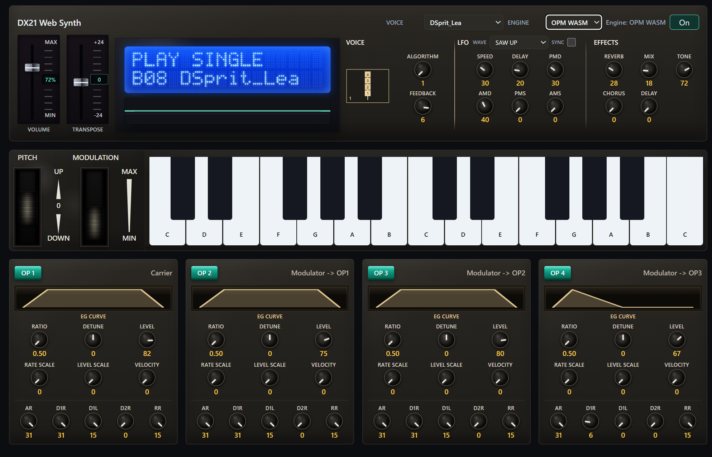

# WebDX21 UI仕様書（Standalone移植用）

上記画像は本仕様の参照スクリーンショットである。画像ファイルは `D:/Hidecade/DX21Native/docs/images/webdx21-ui-reference.png` に配置すること。

## 1. 目的

本書は WebDX21 の現行UI（Web版）を、Standaloneアプリ（JUCE想定）で同一構成・同等操作感で再現するための仕様を定義する。

対象:
- 画面レイアウト
- コントロール種別とパラメータ範囲
- UIイベントと音源エンジン連携
- モバイル/低性能デバイス向け縮退仕様
- 視覚デザイン要件

非対象:
- DSP内部アルゴリズム詳細（別仕様）
- DX21.syxデコード詳細（別仕様）

---

## 2. 画面全体構成

画面は大きく3段構成。

1. Patchパネル（上段）
- 音色選択、エンジン選択、電源、音量、Transpose、LCD、Algorithm/LFO/Effects

2. Keyboardパネル（中段）
- Pitch Wheel、Mod Wheel、25鍵オンスクリーン鍵盤

3. Operatorパネル群（下段）
- OP1〜OP4 各パネル（役割表示、EGカーブ、6ノブ + EG5ノブ）

---

## 3. DOM構造（Web版基準）

主要ID:
- `presetSelect`, `engineSelect`, `audioToggle`, `midiStatus`
- `masterVolume`, `masterVolumeReadout`, `transpose`, `transposeReadout`
- `lcdMode`, `lcdVoice`, `scope`
- `algorithm`, `feedback`, `algorithmFlow`
- `lfoWave`, `lfoSync`, `lfoSpeed`, `lfoDelay`, `lfoPitchDepth`, `lfoAmpDepth`, `lfoPitchSensitivity`, `lfoAmpSensitivity`
- `effectReverb`, `effectMix`, `effectTone`, `effectChorus`, `effectDelay`
- `pitchBendWheel`, `pitchBendValue`, `modWheel`, `modWheelValue`
- `keyboard`, `operators`

Standalone移植では、同名IDの概念に相当するコンポーネント識別子を維持すること。

---

## 4. 画面ブロック仕様

## 4.1 Patchパネル

表示要素:
- タイトル: `DX21 Web Synth`
- Voiceセレクタ（プリセット）
- Engineセレクタ（`OPM WASM` / `JS DX21`）
- MIDIステータス表示
- Powerボタン（On時は表示文字を `On` に変更）
- Volumeフェーダー
- Transposeフェーダー
- LCD（2行ドットマトリクス風）
- Scope（波形）
- Voiceモジュール（Algorithm + Feedback + Algorithm Diagram）
- LFOモジュール
- Effectsモジュール

## 4.2 Keyboardパネル

表示要素:
- Pitch wheel（中央復帰）
- Mod wheel（復帰なし）
- 25鍵オンスクリーン鍵盤（C3〜C5）

## 4.3 Operatorパネル（4枚）

各パネル表示:
- OPトグルボタン（ON/OFF）
- 役割テキスト（Carrier / Modulator -> OPx / Carrier + Modulator -> ...）
- EGグラフ（SVG）
- Operatorノブ 6個
- Envelopeノブ 5個

---

## 5. コントロール仕様（値域）

## 5.1 グローバル/Voice

- `algorithm`: 1..8, step 1
- `feedback`: 0..7, step 1
- `transpose`: -24..24, step 1
- `masterVolume`: 0..1, step 0.01

## 5.2 LFO

- `lfoWave`: 0..3（SAW UP/SQUARE/TRIANGLE/S-HOLD）
- `lfoSync`: bool
- `lfoSpeed`: 0..99
- `lfoDelay`: 0..99
- `lfoPitchDepth`(PMD): 0..99
- `lfoAmpDepth`(AMD): 0..99
- `lfoPitchSensitivity`(PMS): 0..7
- `lfoAmpSensitivity`(AMS): 0..3

## 5.3 Effects

- `effectReverb`: 0..99
- `effectMix`: 0..99
- `effectTone`: 0..99
- `effectChorus`: 0..99
- `effectDelay`: 0..99

## 5.4 Performance Wheels

- `pitchBendWheel`: -1..1, step 0.01
- `modWheel`: 0..1, step 0.01

## 5.5 Operator（OP1..OP4）

- Ratio: 0..63（内部は DX21_RATIOS index）
- Detune: -3..3
- Level: 0..99
- Rate Scale: 0..3
- Level Scale: 0..99
- Velocity: 0..7

Envelope:
- AR: 0..31
- D1R: 0..31
- D1L: 0..15
- D2R: 0..31
- RR: 0..15

---

## 6. 初期化/状態同期仕様

1. `voice/DX21.syx` の読み込みを試行
2. `setupUI()` で state 初期化（VMEMがあればPRESET上書き）
3. UIコントロールへ state を反映
4. `onStateChange(state)` を呼び、音源へ patch を送信
5. Engine表示を URLパラメータ `?opm=0` と同期

LCD初期表示:
- 1行目: `PLAY SINGLE`
- 2行目: `A01 <voice name>` 形式

---

## 7. 入力イベント仕様

## 7.1 共通

- Range系は `wheel` で増減可能
- 多くの数値表示はクリック編集可能（Enter確定 / Escape取消）
- 値確定時は対応 `input`/`change` イベントを発火

## 7.2 Preset変更

- `presetSelect.change`
- stateを対象プリセットへ差し替え
- VMEMがあれば `withVmemPreset` 適用
- Operator再描画、Algorithm図再描画、音源へ patch 送信

## 7.3 Algorithm変更

- `algorithm.input`
- 値更新 + Algorithm図再描画 + Operator役割表示再計算

## 7.4 Transpose

- wheel増減
- ダブルクリックで 0 リセット
- 読み出しバッジを約850ms表示

## 7.5 Volume

- 0..1 を master gain に即時反映
- `%`表示バッジを約850ms表示

## 7.6 Effects

- 変更時に WebAudio ノードパラメータへ即時反映
- Reverb impulse は値丸めキャッシュ

## 7.7 Wheels

Pitch:
- 入力時に `pitchBend` 送信
- `pointerup`/`pointercancel`/`blur` で 0 に自動復帰

Mod:
- 入力時に `modWheel` 送信
- 自動復帰なし

## 7.8 鍵盤（画面）

- 25鍵を動的生成
- `pointerdown`: noteOn(velocity=104)
- `pointerup`/`pointerleave(button押下時)`: noteOff

## 7.9 鍵盤（PCキーボード）

マッピング:
- `A W S E D F T G Y H U J K O L P ;`
- MIDI Note 60..76

仕様:
- リピート押下防止（active set）
- テキスト編集中は無効

## 7.10 MIDI入力

- Note On/Off
- Pitch Bend
- Mod Wheel(CC#1)
- MIDIステータス文字列をヘッダ表示

---

## 8. 音源連携メッセージ

UIからProcessorへ送る種別:
- `patch`
- `noteOn`
- `noteOff`
- `pitchBend`
- `modWheel`
- `panic`（ノード差し替え時）

Engine切替時:
- 現ノードに `panic`
- 新ノード生成後、`patch/pitchBend/modWheel` 再送
- 押下中ノートを再送

---

## 9. 可視化仕様

## 9.1 LCD

- 16文字x2行
- 5x8ドットフォント（独自グリフ定義）
- 文字は超過分切り捨て、未満は空白埋め

## 9.2 Scope

- Analyser time-domain描画
- 通常 60fps相当（16ms間隔）
- lowPowerDeviceでは 10fps相当（100ms間隔）

## 9.3 Silence監視と自動復旧

条件:
- Audio running
- note保持中
- 音量 > 0.01
- noteOnから350ms経過
- 波形ピークが閾値以下の無音が1400ms継続

動作:
- `Audio silence detected: restarting engine` を表示
- synthノード再生成

---

## 10. レスポンシブ仕様

ブレークポイント:
- `max-width: 1500px`: 1カラム前提維持
- `max-width: 1180px` かつ `min-width: 861px`: Operatorを2列
- `max-width: 1040px`: patch modules を縦積み
- `max-width: 860px`: 全体を単列寄せ、鍵盤/ホイールを縮退
- `max-width: 700px` または `max-height: 500px & coarse pointer`:
  - `--ui-scale` を縮小（0.56、横向きは0.64）
  - 影や装飾を軽量化
  - 主要ノブ/EGを小型化
  - lowPowerDevice扱い

lowPowerDevice判定式:
- `(max-width: 700px) OR ((max-height: 500px) AND pointer: coarse)`

---

## 11. 視覚デザイン要件（再現目標）

- 全体: ダーク基調のハードウェア風パネル
- 角丸: 小さめ（3〜8px）
- LCD: 強い青発光 + ドット表示
- ノブ: 円形ダイヤル + 指針（-135〜+135deg）
- フェーダー: 縦スライダー + スケール印字
- ホイール: スロット内ローラー風表現
- Operator ONボタン: 緑発光、OFF時はブラウン低輝度

Standaloneでは Web CSS を完全再現できなくても、以下は必須。
- ブロック配置
- 情報階層
- 値表示位置
- 操作モデル（マウスホイール、直接入力、ダブルクリック復帰）

---

## 12. Standalone実装ガイド（JUCE想定）

推奨コンポーネント対応:
- `ComboBox`: Voice/Engine/Wave
- `TextButton`: Power/OPトグル
- `Slider(LinearVertical)`: Volume/Transpose/Wheels
- `Slider(Rotary)`: 各ノブ
- `ToggleButton`: LFO Sync
- `Component + Graphics`: LCD, Scope, Algorithm diagram, EG graph, Keyboard

必須挙動:
1. Web版と同じ値域・step
2. Pitch wheelの自動センタ復帰
3. 値のテキスト直接編集
4. Preset変更時の再描画順（Operator->Algorithm->Patch送信）
5. lowPowerモード相当の描画間引き

---

## 13. 受け入れ条件（UI同等性チェック）

1. 画面を見たとき、上段/中段/下段の構造が一致する
2. 全コントロールの値域と初期値が一致する
3. Preset変更でLCD/Operator/Algorithm図が同期更新される
4. Keyboard/PCキー/MIDIで同じように発音できる
5. Engine切替で音切れ後に自動再接続される
6. モバイル相当サイズでレイアウト破綻しない

---

## 14. 参照実装

- `WebDX21/index.html`
- `WebDX21/src/styles.css`
- `WebDX21/src/ui.js`
- `WebDX21/src/main.js`
- `WebDX21/src/midi.js`
